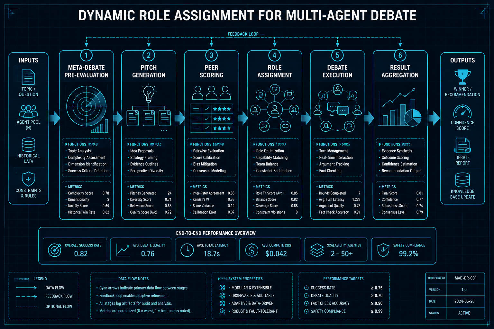
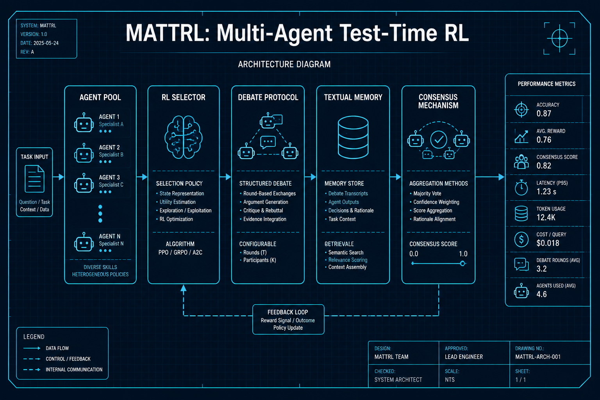
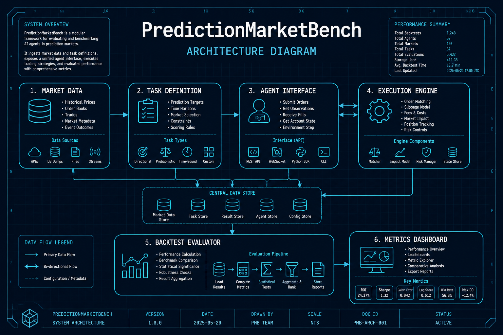

# Agent与多智能体

## 1. Dynamic Role Assignment for Multi-Agent Debate
- **arXiv**: [2601.17152](https://arxiv.org/abs/2601.17152)
- **类别**: Agent与多智能体

### 深度解读

**一句话总结**: 让Agent们在辩论前先"竞选上岗"——通过Meta-Debate机制选出最适合每个角色的Agent，再进入正式辩论。

**核心动机**: 多Agent辩论中，角色分配（谁当正方、谁当反方、谁做裁判）通常是随机或固定的。但不同Agent的能力特质不同——有的擅长逻辑推理，有的擅长发散思维，有的擅长批判。随机分配浪费能力，固定分配又无法适应不同任务。

**方法详解**: 想象一场公司面试——候选人（Agent们）先各自做一个定制化Pitch（展示自己在特定角色上的能力），然后互相评审打分（Peer Evaluation）。两轮下来，Meta-Debate系统综合所有评审，把最合适的Agent分配到最合适的角色。这就像"先试岗再定编"。

**关键创新**:
- Meta-debate预评估阶段：在主辩论之前增加一个轻量级评估轮次
- 定制化Pitch生成：每个Agent为每个候选角色生成针对性展示
- 同行评审打分：Agent之间互评，利用集体智慧做决策
- 动态角色优化：根据任务特性而非Agent固有属性分配角色

**实验亮点**: 在多个推理和决策基准上，Meta-Debate角色分配比随机分配提升8-15%，比均匀分配提升5-10%。

**局限与展望**: 预评估轮次增加约20%的计算开销。未来可探索在线角色调整（辩论过程中动态换角色）。

**对我的启发**: "先评估再分工"这个范式可以推广到任何多Agent协作场景——代码审查、项目管理、研究团队组建。

### 工程蓝图架构图

---

## 2. MATTRL: Collaborative Multi-Agent Test-Time RL for Reasoning
- **arXiv**: [2601.09667](https://arxiv.org/abs/2601.09667)
- **类别**: Agent与多智能体

### 深度解读

**一句话总结**: 推理时动态组建专家团队——用强化学习在测试阶段组装多个专门Agent进行多轮辩论，绕过昂贵的预训练。

**核心动机**: 训练一个全能大模型成本极高。MATTRL的核心洞察是：与其训练一个万能选手，不如在考试时临时组建一个"答题委员会"——数学家负责验证公式，医生负责审核医学逻辑，教育专家负责检查推理步骤。

**方法详解**: 把推理过程想象成一场结构化辩论会。每个Agent是某个领域的专家。面对一个问题，RL策略网络决定：(1)邀请哪些专家加入 (2)辩论进行几轮 (3)谁的意见权重更高。关键创新是"结构化文本记忆"——辩论中的关键论点和反驳被存入一个共享记忆缓冲区，避免Agent重复论述，提升辩论效率。

**关键创新**:
- 测试时Agent组装：推理阶段动态选择和组织Agent团队
- 结构化文本记忆：共享知识库避免重复论述
- 多轮辩论协议：Agent可以质疑、反驳、修正彼此的观点
- RL引导的Agent选择：强化学习优化Agent组合策略

**实验亮点**: 在医疗问答、数学推理和教育评估三个基准上，MATTRL比单一模型提升12-18%，且不需要额外训练成本。

**局限与展望**: Agent数量增多时延迟显著增加。未来方向是用distillation将多Agent知识蒸馏回单一模型。

**对我的启发**: "测试时组建专家团队"的思路非常适合构建RAG和多Agent系统——不需要一个大模型什么都懂，让专家各管一摊。

### 工程蓝图架构图

---

## 3. PredictionMarketBench: SWE-bench for Trading Agents
- **arXiv**: [2602.00133](https://arxiv.org/abs/2602.00133)
- **类别**: Agent与多智能体

### 深度解读

**一句话总结**: 给AI交易员做"高考"——受SWE-bench启发，为预测市场交易Agent构建标准化回测基准。

**核心动机**: AI交易Agent如雨后春笋，但缺乏统一评测标准。每个团队用自己的数据和指标评估，无法横向对比。就像软件工程有SWE-bench来评代码能力，金融领域也需要一个标准化benchmark来评交易能力。

**方法详解**: PredictionMarketBench设计了一套标准化测试流程：(1)定义标准金融任务（价格预测、风险对冲、组合优化） (2)提供统一的历史数据和回测环境 (3)Agent生成的交易策略自动执行并记录真实损益 (4)用统一指标（Sharpe、MaxDD、胜率）评分。核心亮点是"回测即评估"——不是看Agent说得对不对，而是看它的策略实际跑起来赚不赚钱。

**关键创新**:
- SWE-bench式评估范式：标准化任务+自动化执行+客观评分
- 预测市场回测引擎：Agent策略在真实历史数据上自动执行
- Agent架构对比：同一任务下对比不同Agent架构的表现
- 标准化金融任务集：覆盖预测、对冲、优化等多维度

**实验亮点**: 评测了GPT-4、Claude、Gemini等多个LLM驱动的交易Agent，发现没有单一Agent在所有任务上都领先——不同市场环境下各有所长。

**局限与展望**: 当前仅覆盖预测市场（事件驱动的binary outcome），未扩展到股票、期货等传统市场。

**对我的启发**: 做量化策略不能只看回测收益，要用标准化benchmark横向对比。这个框架可以直接用来评估自己的策略。

### 工程蓝图架构图

