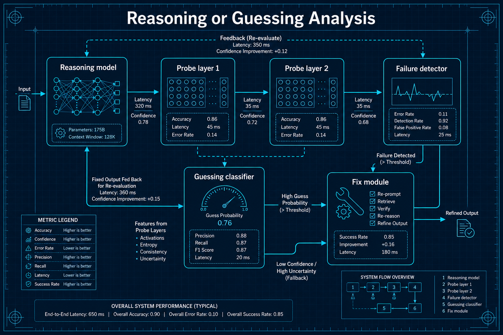
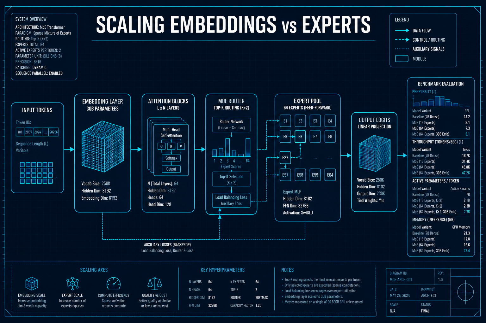

# LLM理论与分析

## 1. Are Your Reasoning Models Reasoning or Guessing?
- **arXiv**: [2601.10679](https://arxiv.org/abs/2601.10679)
- **类别**: LLM理论与分析

### 深度解读

**一句话总结**: 发现推理模型的"皇帝新衣"——它们经常是在"猜"而非真正"推理"，并识别出三种具体的失败模式。

**核心动机**: o1、DeepSeek-R1等推理模型在benchmark上表现惊人，但一个根本性问题是：它们真的在"推理"还是在做高级"模式匹配"？如果是后者，那在分布外的问题上就会失败。这篇论文用机制分析（mechanistic analysis）方法揭示了真相。

**方法详解**: 研究者设计了精巧的探针实验来检测模型内部状态：(1)在简单问题上注入微小扰动，看模型是否基础假设崩溃 (2)追踪中间层准确率的变化曲线，看是否存在"突变跳跃" (3)分析错误状态的恢复能力，看模型是否能从错误路径回到正确推理。

**关键创新**:
- 三种失败模式：(a)简单问题上的基础假设崩溃 (b)准确率突然跳跃（不是平滑改进）(c)困在错误状态无法恢复
- 推理vs猜测的区分方法：通过探针实验区分"真推理"和"模式匹配"
- 修复方案：数据集扩展（增加问题多样性）、输入扰动、训练随机化
- 对模型评估的启示：单一benchmark分数不能反映推理质量

**实验亮点**: 在多个推理模型上验证了三种失败模式普遍存在，即使在benchmark上得分很高的模型也会在特定条件下"猜测"。

**局限与展望**: 探针实验需要对模型内部状态有访问权限，对闭源模型不适用。

**对我的启发**: 评估推理模型不能只看benchmark分数，要设计对抗性测试检查"真推理vs猜测"。在生产环境中使用推理模型时，务必加入异常检测。

### 工程蓝图架构图

---

## 2. Scaling Embeddings Outperforms Scaling Experts
- **arXiv**: [2601.21204](https://arxiv.org/abs/2601.21204)
- **类别**: LLM理论与分析

### 深度解读

**一句话总结**: MoE架构的新发现——把参数花在"词汇理解"（嵌入层）上，比花在"专家数量"上更划算。

**核心动机**: MoE（Mixture of Experts）架构是当前大模型的主流设计。一个自然的扩展方向是增加专家数量——更多专家=更强能力。但这篇论文用实验证明，在给定计算预算下，扩展嵌入层维度比增加专家数量更有效。

**方法详解**: 研究者系统性地对比了两种MoE扩展策略：(1)增加专家数量（如从8到16到32）(2)扩展嵌入层维度（如从2048到4096到8192）。在相同的总参数量和FLOPs约束下，嵌入扩展在代码生成和Agent任务上表现更好。原因是：嵌入层质量直接影响Token表示的丰富度，而过多专家会导致路由不稳定和利用率低。

**关键创新**:
- 嵌入>专家扩展规律：在特定计算预算下，嵌入维度扩展收益更高
- MoE计算预算分配：提出了最优参数分配的实用指南
- LongCat-Flash-Lite：68.5B总参数/3B激活的验证模型
- 30B+参数嵌入层：证明超大嵌入层在推理时几乎无额外计算成本

**实验亮点**: LongCat-Flash-Lite（68.5B总/3B激活）在代码和Agent基准上超越了多个更大模型，推理时仅激活3B参数，极高效。

**局限与展望**: 规律在极大规模（>500B）下是否成立尚待验证。嵌入扩展可能受限于词汇表大小。

**对我的启发**: 设计MoE模型时不要盲目堆专家数量。嵌入层是"低垂的果实"——推理时不增加计算成本，但对表示质量影响巨大。

### 工程蓝图架构图

