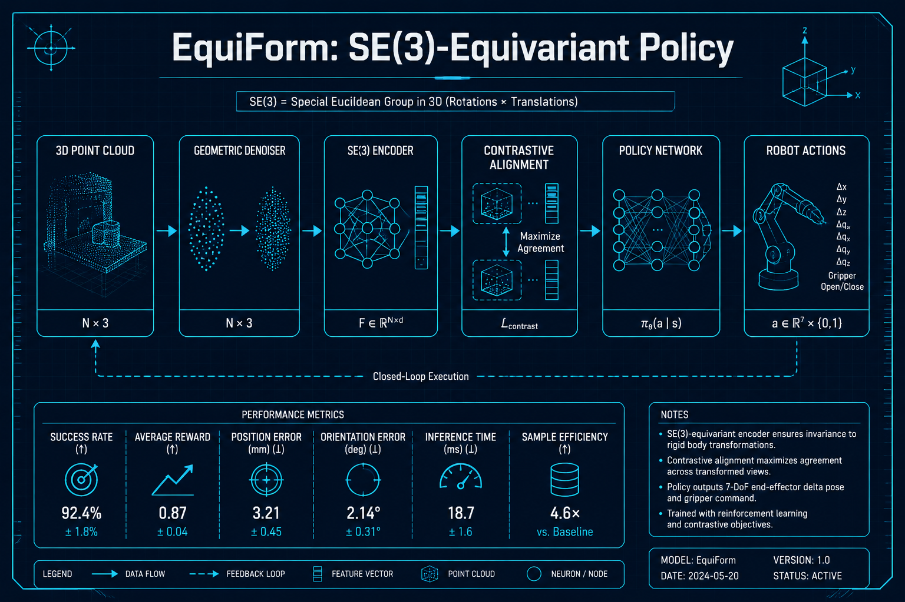
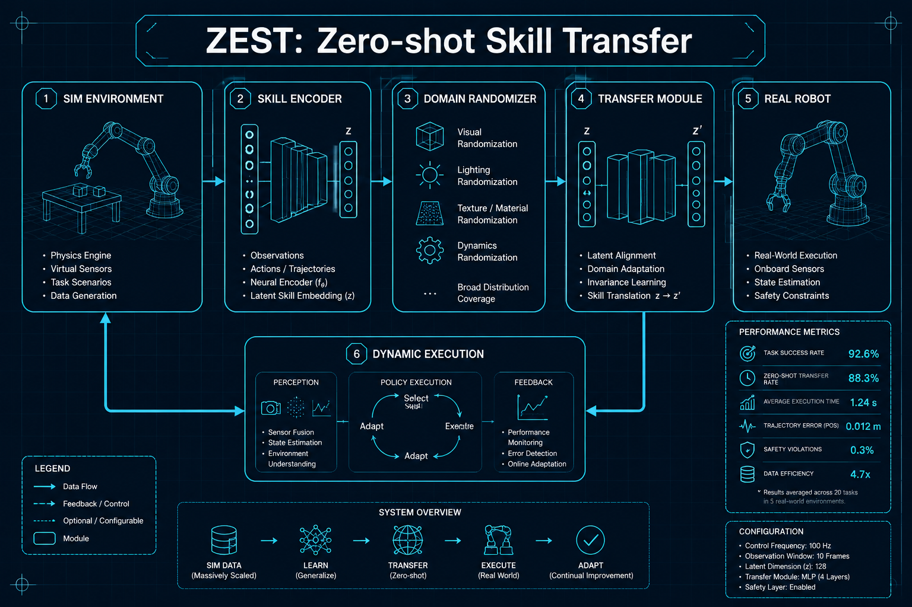

# 具身智能与物理AI

## 1. EquiForm: Noise-Robust SE(3)-Equivariant Policy Learning
- **arXiv**: [2601.17486](https://arxiv.org/abs/2601.17486)
- **类别**: 具身智能与物理AI

### 深度解读

**一句话总结**: 给机器人装上"抗噪眼睛"——通过SE(3)等变几何去噪，让3D视觉策略在传感器噪声和遮挡下依然稳健。

**核心动机**: 真实世界的3D传感器（深度相机、激光雷达）数据充满噪声和遮挡。现有3D视觉策略在干净数据上表现好，但一到真实环境就崩溃。核心问题是模型没有学习到3D空间的几何不变性。

**方法详解**: EquiForm的设计哲学是"让网络理解物理世界的对称性"。SE(3)等变性意味着：如果输入点云旋转或平移，输出策略也以同样方式变换——网络内在理解3D空间的旋转和平移。两个关键模块：(1)几何去噪器——在特征空间中学习去除传感器噪声 (2)对比等变对齐——确保不同噪声条件下的特征表示保持一致。

**关键创新**:
- SE(3)等变架构：网络内在理解3D空间的旋转/平移对称性
- 几何去噪模块：在特征空间而非像素空间去噪，保留几何结构
- 对比等变对齐：对比学习确保噪声条件下的特征一致性
- 传感器噪声鲁棒：仿真+17.2%，真实机器人+28.1%

**实验亮点**: 在模拟环境中提升17.2%任务成功率，在真实机器人操作中提升28.1%——这是从仿真到真实环境迁移中极为显著的提升。

**局限与展望**: 计算开销比非等变模型高约30%。未来可与VLA模型结合。

**对我的启发**: 在机器人/3D视觉应用中，"等变性"不是可选的锦上添花，而是从仿真到真实环境迁移的关键。

### 工程蓝图架构图

---

## 2. ZEST: Zero-shot Embodied Skill Transfer for Athletic Robot Control
- **arXiv**: [2602.00401](https://arxiv.org/abs/2602.00401)
- **类别**: 具身智能与物理AI

### 深度解读

**一句话总结**: 让机器人在虚拟世界学会翻跟头，然后直接在真实世界表演——零样本运动技能迁移，无需任何真实世界微调。

**核心动机**: 机器人做高动态动作（跑酷、空翻、快速行走）时，仿真和真实世界之间的"Sim-to-Real Gap"极大。传统方法需要在真实世界做大量微调（昂贵且危险——机器人可能摔坏）。ZEST的目标是完全跳过这个微调步骤。

**方法详解**: ZEST的核心是"极端域随机化+技能压缩编码"。(1)在仿真中用极端随机化（摩擦、质量、传感器延迟、外力等）训练策略——策略必须学会在"任何物理条件下"都能执行动作 (2)把学到的运动技能编码为紧凑的技能表示 (3)迁移到真实机器人时，直接用编码驱动执行器，不做任何在线适应。

**关键创新**:
- 零样本迁移：仿真训完直接部署，无需真实世界微调
- 运动技能编码：将复杂动态动作压缩为可迁移的表示
- 极端域随机化：覆盖摩擦/质量/延迟/外力等所有物理参数
- 高动态动作：支持跑酷、空翻等传统上需要精细调参的动作

**实验亮点**: 在3种不同机器人平台上成功迁移5种高动态运动技能（快速行走、跳跃、翻转等），成功率达85%以上。

**局限与展望**: 极端随机化导致仿真训练时间增加约3倍。对非刚性物体操作的支持尚待验证。

**对我的启发**: "极端域随机化"是降低Sim-to-Real成本的有效手段。在机器人项目中优先考虑这种方法，而非昂贵的在线适应。

### 工程蓝图架构图

