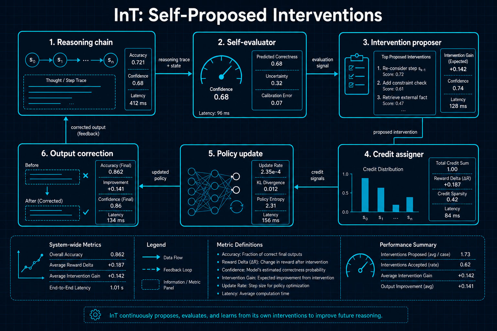
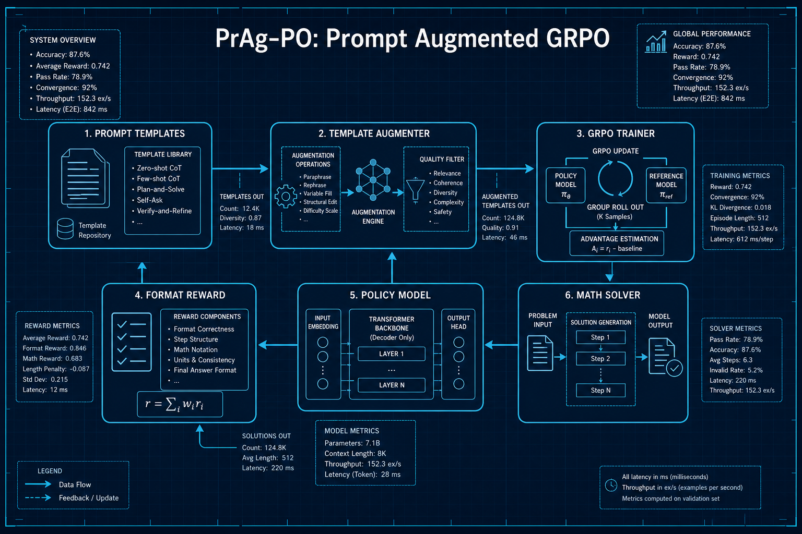

# 推理与强化学习

## 1. InT: Self-Proposed Interventions for Credit Assignment in LLM Reasoning
- **arXiv**: [2601.14209](https://arxiv.org/abs/2601.14209)
- **类别**: 推理与强化学习

### 深度解读

**一句话总结**: 让LLM自己当"错题分析师"——推理出错时，模型自我评估哪一步有问题并提出修正方案，解决了推理RL中的信用分配难题。

**核心动机**: 用强化学习训练LLM做推理时，一个核心难题是"信用分配"：如果最终答案错了，到底是哪一步推理出了问题？传统方法需要外部奖励模型逐步打分，成本极高且不够准确。InT让模型自己解决这个问题。

**方法详解**: 想象一个学生做完数学题后回头检查。InT让模型在推理链的每一步之后暂停，评估："这一步逻辑对不对？如果不对，应该怎么改？"模型生成一个"干预建议"（Intervention），说明当前步骤的问题和修正方向。RL策略网络学习何时接受干预、何时继续原路推理。

**关键创新**:
- 自我评估推理步骤：模型不需要外部评分器就能评估自己的逻辑质量
- 干预建议生成：不仅发现问题，还提出具体修正方案
- 无外部奖励的信用分配：通过干预机制内部化信用分配
- 数学准确率提升14%：在多个数学基准上验证有效

**实验亮点**: 在GSM8K和MATH基准上，InT比标准RL方法提升14%，甚至超越了一些参数量更大的公开模型。

**局限与展望**: 自我评估的准确性有上限——模型很难发现自己"不知道自己不知道"的错误。

**对我的启发**: 在Agent工作流中加入"自检+干预"步骤是一个低成本高收益的设计模式。

### 工程蓝图架构图

---

## 2. PrAg-PO: Prompt Augmentation Scales up GRPO Training
- **arXiv**: [2602.03190](https://arxiv.org/abs/2602.03190)
- **类别**: 推理与强化学习

### 深度解读

**一句话总结**: 给GRPO训练"换着花样出题"——通过提示模板增强和模板专属奖励，解决RL微调早期训练崩溃的问题。

**核心动机**: GRPO（Group Relative Policy Optimization）是当前最流行的LLM推理RL微调方法。但实践中经常遇到"训练早期崩溃"——模型在最初几轮RL更新后迅速收敛到一个次优策略，后续无法恢复。根本原因是训练信号多样性不足。

**方法详解**: PrAg-PO的解决方案很巧妙：(1)把同一道数学题用多种不同的提示模板呈现（标准表述、分步引导、逆向思考等） (2)每种模板配一个专属的格式奖励——不仅看答案对不对，还看模型是否按该模板要求的格式推理。这就像老师出题时不只出"计算题"，还出"证明题""应用题""反向验证题"，迫使模型从多角度理解同一个概念。

**关键创新**:
- 提示模板增强：同一问题多种表述方式，增加训练信号多样性
- 模板专属格式奖励：不同模板要求不同的推理格式
- 防止训练崩溃：多样性避免了模型过早收敛
- GRPO增强：与现有GRPO框架无缝集成

**实验亮点**: 在MATH和GSM8K上，PrAg-PO比标准GRPO提升3-5%，且训练曲线更平稳、更早进入有效学习阶段。

**局限与展望**: 模板设计需要人工参与，自动化模板生成是未来方向。

**对我的启发**: 做RL微调时，"数据多样性"比"数据量"更重要。换着花样出题是一个简单但有效的策略。

### 工程蓝图架构图

