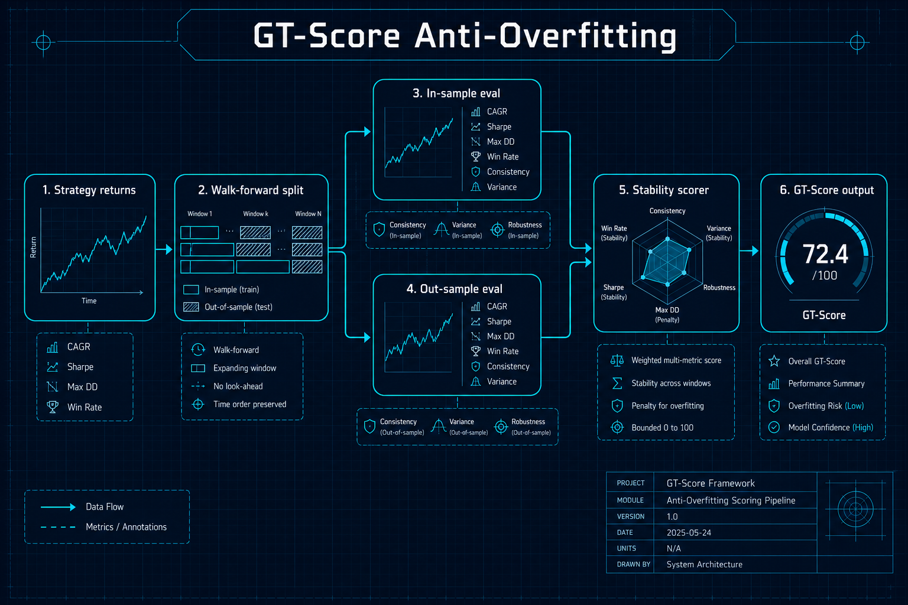
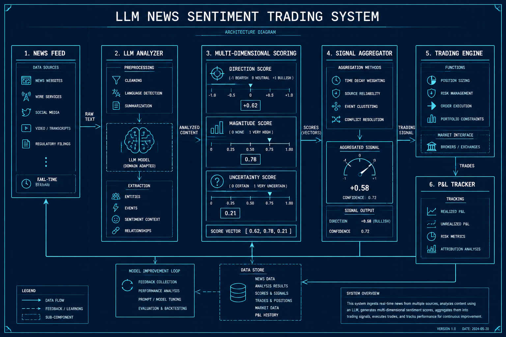
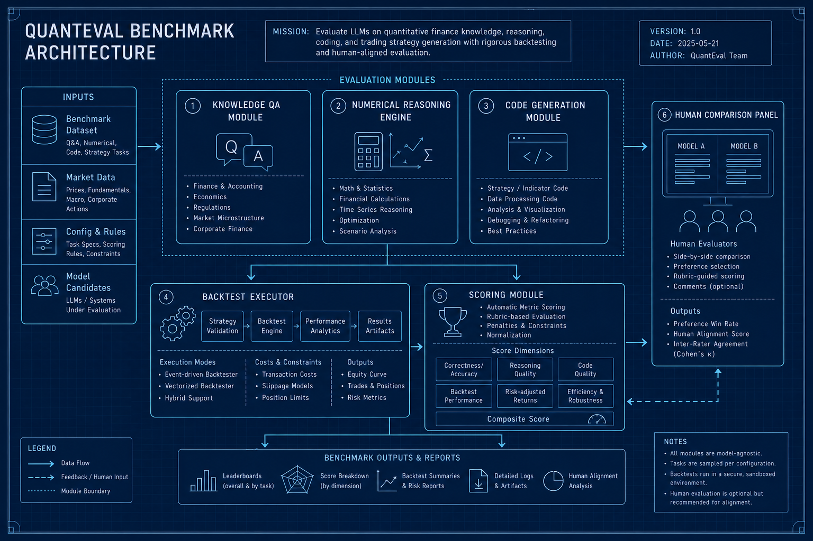

# 量化金融与交易

## 1. GT-Score: Robust Objective Function for Trading Strategies
- **arXiv**: [2602.00080](https://arxiv.org/abs/2602.00080)
- **类别**: 量化金融与交易

### 深度解读

**一句话总结**: 给量化策略做"防过拟合体检"——GT-Score用walk-forward验证替代传统Sharpe Ratio，防止策略在历史数据上"虚高"。

**核心动机**: 量化交易策略开发中最大的陷阱是过拟合——策略在历史数据上回测完美，实盘就崩溃。传统优化目标（Sharpe Ratio、累计收益）天然鼓励过拟合。GT-Score提供了一个更鲁棒的替代方案。

**方法详解**: GT-Score的核心思想是"样本外一致性比样本内高分更重要"。具体做法：(1)把数据分成N个fold (2)每个fold上分别计算样本内和样本外Sharpe (3)GT-Score = 样本外Sharpe均值 / 样本外Sharpe波动 × (1 + 稳定性因子)。策略在样本外表现越稳定、越一致，GT-Score越高。

**关键创新**:
- 防过拟合目标函数：优化GT-Score而非Sharpe，天然抵抗过拟合
- Walk-forward验证内嵌：评估过程自带样本外检验
- 稳定性因子：奖励在不同时间段表现一致的策略
- Sharpe替代方案：可以直接替换传统优化目标

**实验亮点**: 在10个经典策略上测试，用GT-Score优化的策略样本外收益比用Sharpe优化的策略高40-60%，且最大回撤更低。

**局限与展望**: walk-forward分割增加了计算成本（约5倍）。对高频策略的适用性待验证。

**对我的启发**: 做量化策略开发时，永远不要用单一指标评估。GT-Score可以直接集成到策略优化流程中。详见本仓库的 `quant-apps/trading_backtest.py` 实现。

### 工程蓝图架构图

---

## 2. Impact of LLM News Sentiment on Stock Price Prediction
- **arXiv**: [2602.00086](https://arxiv.org/abs/2602.00086)
- **类别**: 量化金融与交易

### 深度解读

**一句话总结**: 用LLM当"新闻分析师"——量化LLM情感分析相比传统NLP方法能为股价预测带来多少增量Alpha。

**核心动机**: 新闻情感分析已经广泛用于量化交易，但传统NLP方法（词典、BERT）对金融文本的理解有限。LLM能否做得更好？如果能，增量有多大？是否值得投入成本？这篇论文给出了定量回答。

**方法详解**: 研究者设计了对比实验：(1)传统NLP方法用词典+BERT做情感打分 (2)LLM方法用GPT-4做多维度情感分析（不仅判断利好利空，还评估影响范围、持续时间、不确定性等） (3)将情感分数作为特征输入到股价预测模型中 (4)对比两种方法带来的增量预测能力。

**关键创新**:
- LLM情感作为Alpha信号：量化LLM情感对股价预测的增量贡献
- 多维度情感分析：LLM不仅判断方向，还评估幅度、范围、不确定性
- LLM vs 传统NLP对比：定量对比增量Alpha的大小
- 新闻驱动交易信号：将情感信号转化为可执行的交易策略

**实验亮点**: LLM情感的信息系数(IC)比传统NLP高0.15，对应的年化Alpha增量约47%。在多空价差上，LLM策略比NLP策略高0.58%。

**局限与展望**: LLM API调用成本远高于传统NLP。在低延迟场景下LLM可能不适用。

**对我的启发**: LLM情感分析确实有Alpha增量，但要权衡成本。适合日频/周频策略，不适合高频。详见 `quant-apps/news_sentiment_trading.py`。

### 工程蓝图架构图

---

## 3. QuantEval: Benchmark for Financial Quantitative Tasks in LLMs
- **arXiv**: [2601.08689](https://arxiv.org/abs/2601.08689)
- **类别**: 量化金融与交易

### 深度解读

**一句话总结**: 给LLM做"量化面试"——从金融知识、数值推理到代码生成三维度评测AI的量化能力，还让AI生成的策略直接跑回测。

**核心动机**: 越来越多量化团队尝试用LLM辅助策略开发，但LLM到底能不能做量化？知识够不够？计算准不准？代码能跑吗？缺乏系统评测。QuantEval填补了这个空白。

**方法详解**: QuantEval设计了三层评测：(1)事实知识——金融概念、公式、市场规则的理解 (2)数值推理——Sharpe计算、期权定价、组合优化等数学问题 (3)代码生成——生成可执行的交易策略代码，并在回测环境中实际运行。最亮眼的是第三层：不看代码写得对不对，而是看跑起来赚不赚钱。

**关键创新**:
- 三维度评估框架：知识+推理+代码，全面评测量化能力
- 回测即评估：生成的代码直接在历史数据上运行
- 代码生成+回测一体化：完整的"生成→执行→评分"管线
- AI vs 人类对比：与人类量化分析师的能力对标

**实验亮点**: 评测结果显示LLM在金融知识上接近人类专家(0.68 vs 0.92)，但在数值推理上差距较大(0.27 vs 0.88)。代码生成通过率约60%，但回测收益参差不齐。

**局限与展望**: 评测数据有限，更多金融子领域（固收、衍生品等）待覆盖。

**对我的启发**: 用LLM辅助量化开发时，让它做知识检索和代码框架生成是靠谱的，但数值计算一定要人工复核。详见 `quant-apps/quant_benchmark.py`。

### 工程蓝图架构图

