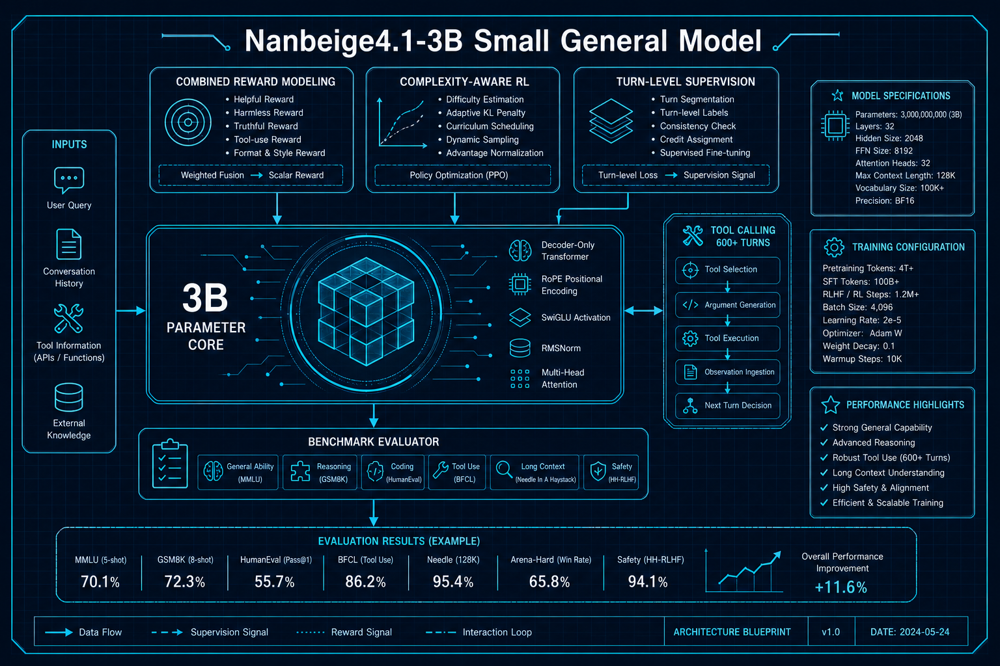
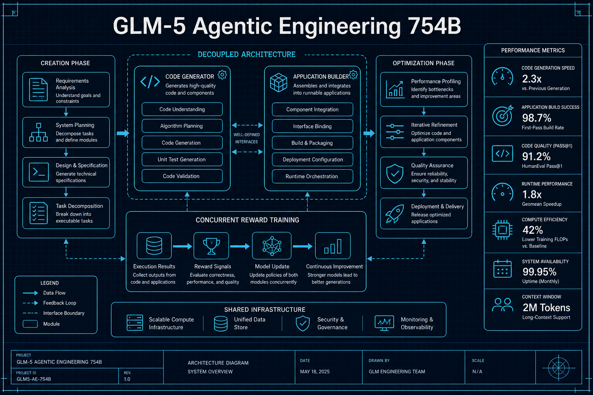

# Agent与大模型

## 1. Nanbeige4.1-3B: 3B参数如何超越30B模型
- **arXiv**: [2602.13367](https://arxiv.org/abs/2602.13367)
- **类别**: Agent与大模型

### 深度解读

**一句话总结**: 一个只有3B参数的小模型，通过精巧的训练策略，在Agent行为、代码生成和通用推理上全面超越了30B级别的模型。

**核心动机**: 大模型能力强大但部署成本高昂。能否用极小的模型（3B）实现接近大模型的能力？这不仅关乎效率，更关乎AI普惠化。

**方法详解**: Nanbeige4.1-3B的三板斧：(1)组合奖励建模——不靠单一奖励信号，而是组合多种奖励维度（准确性、格式、安全性等）来引导模型行为 (2)复杂度感知RL——在代码生成时，RL奖励会考虑代码复杂度，鼓励简洁高效的实现 (3)Turn级监督——支持长达600轮的工具调用，每一轮都有细粒度的监督信号。

**关键创新**:
- 组合奖励建模：多维度奖励信号的协同
- 复杂度感知RL：奖励不仅看对错，还看代码质量
- Turn级监督：600+轮工具调用的稳定性
- 3B超越30B：小模型的训练策略比参数量更重要

**实验亮点**: 在Agent和代码生成基准上超越Qwen3-30B-A3B，证明了训练策略可以弥补参数差距。

**对我的启发**: 不要盲目追求大模型。精巧的训练策略（特别是奖励设计）比堆参数更有效。

### 工程蓝图架构图

---

## 2. GLM-5: 从Vibe Coding到Agentic Engineering
- **arXiv**: [2602.15763](https://arxiv.org/abs/2602.15763)
- **类别**: Agent与大模型

### 深度解读

**一句话总结**: 754B参数的前沿模型，用"解耦优化"让AI编程从"随意生成"升级为"工程化构建"。

**核心动机**: 当前AI编程（Vibe Coding）的问题：模型擅长写单个函数，但不擅长构建完整的应用。GLM-5的核心洞察是：构建应用需要"创造"和"优化"两种不同的思维模式。

**方法详解**: GLM-5把编程过程解耦为两个阶段：(1)创造阶段——理解需求、设计架构、生成初始代码 (2)优化阶段——审查代码、修复bug、性能调优。两个阶段使用不同的奖励模型，通过并发训练让模型同时掌握两种能力。

**关键创新**:
- 解耦优化架构：创造与优化分离训练
- 并发奖励驱动：两种奖励信号同时作用
- Agentic Engineering：从写代码到构建应用
- 全开源：754B参数模型代码和权重完全开放

**实验亮点**: 在公共基准上达到SOTA，在实际应用构建任务上表现尤为突出。

**对我的启发**: "创造"和"优化"是两种不同的认知模式，在Agent系统中应该显式分离。

### 工程蓝图架构图

