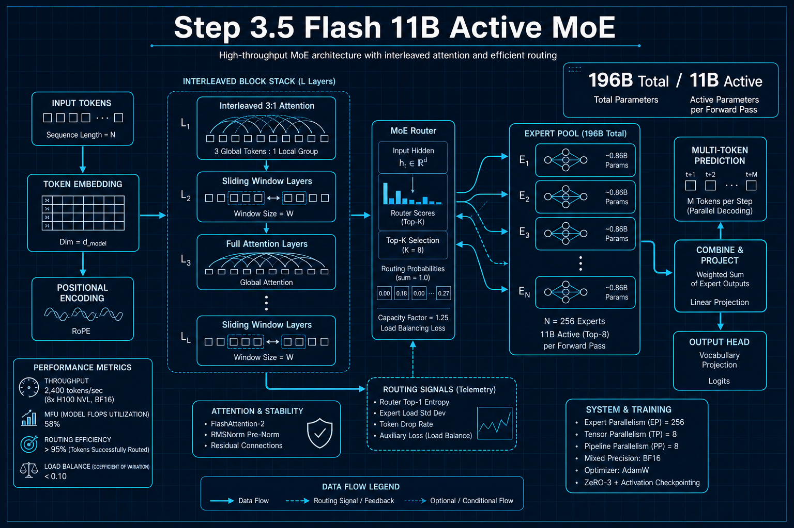
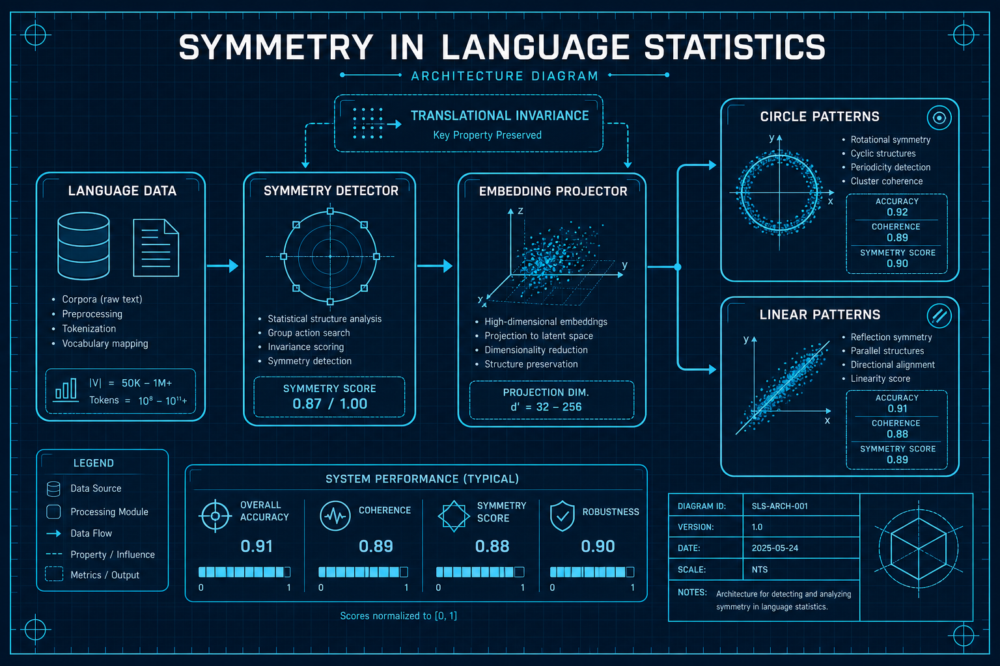

# LLM理论与分析

## 1. Step 3.5 Flash: 11B激活参数的前沿智能
- **arXiv**: [2602.10604](https://arxiv.org/abs/2602.10604)
- **类别**: LLM理论与分析

### 深度解读

**一句话总结**: 196B总参数但推理时只激活11B，用交错注意力和多Token预测实现低延迟，推理能力对标GPT-5.2。

**核心动机**: 前沿模型能力强大但推理太慢太贵。能否在保持前沿能力的同时，把推理成本降到可大规模部署的水平？

**方法详解**: Step 3.5 Flash的两个关键设计：(1)交错3:1注意力——每4层中3层用滑窗注意力（快但视野窄），1层用全注意力（慢但全局视野）。这比全注意力快得多，但信息仍能全局传播。(2)多Token预测——一次预测多个Token而非一个，大幅提升吞吐。

**关键创新**:
- 交错3:1注意力：效率和效果的最优平衡
- 多Token预测：吞吐量提升数倍
- 11B激活参数：推理成本极低
- 对标GPT-5.2：IMO 85.4%，代码86.4%

**实验亮点**: IMO-AnswerBench 85.4%，LiveCodeBench-v6 86.4%，tau2-Bench 88.2%——全部对标闭源前沿模型。

**对我的启发**: MoE+交错注意力是当前最有效的"大规模小推理"方案。部署Agent系统时应优先考虑这类架构。

### 工程蓝图架构图

---

## 2. Symmetry in Language Statistics Shapes Model Representations
- **arXiv**: [2602.15029](https://arxiv.org/abs/2602.15029)
- **类别**: LLM理论与分析

### 深度解读

**一句话总结**: 发现LLM嵌入空间中的美丽几何——月份排成圆圈，年份排成直线，语言中的对称性决定了这些空间排列。

**核心动机**: 我们知道LLM的嵌入空间包含丰富的结构信息，但这些结构的形成机制是什么？是训练算法决定的，还是语言本身的性质决定的？

**方法详解**: 研究者发现了一个深刻的规律：语言数据中的"平移不变性"（translational invariance）直接决定了嵌入空间的几何结构。例如：月份之间有循环对称性（1月→2月→...→12月→1月），所以在嵌入空间中排成圆圈。年份之间有线性对称性（2020→2021→2022），所以排成直线。这些结构即使改变训练数据也保持稳定。

**关键创新**:
- 语言对称性→空间几何：建立了语言统计与几何的直接联系
- 月份圆圈/年份直线：直观的实证发现
- 平移不变性：理论解释了结构稳定性
- 数据无关性：即使改变训练数据，结构依然保持

**实验亮点**: 在多种不同架构和训练数据上验证了同一规律，证明这是语言的内在性质而非训练伪影。

**对我的启发**: LLM的内部表示不是黑箱——它们反映了语言的数学结构。这为可解释性研究提供了新视角。

### 工程蓝图架构图

