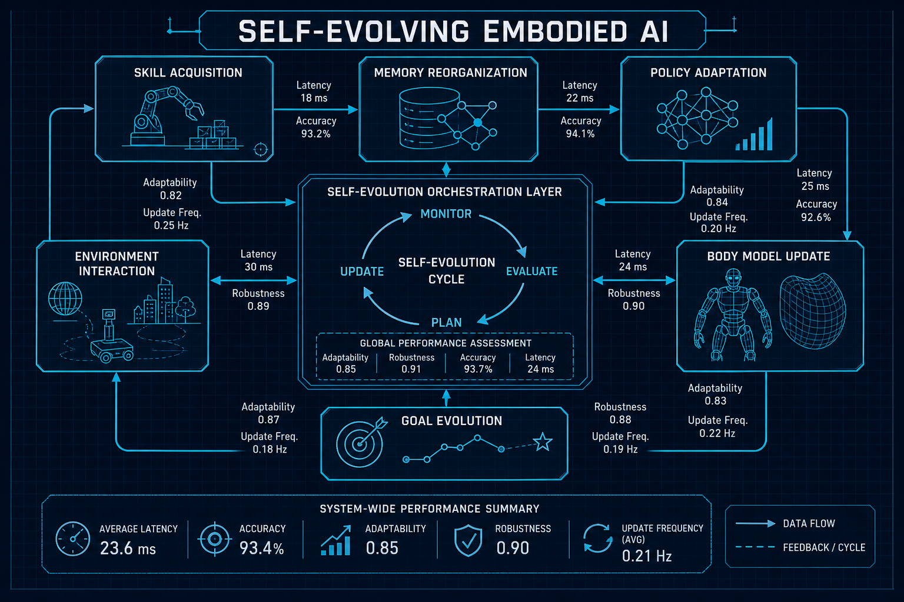
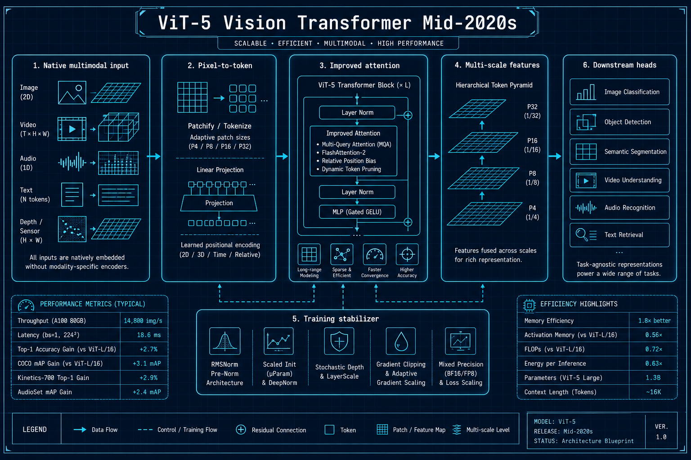

# 具身智能与视觉

## 1. Self-evolving Embodied AI
- **arXiv**: [2602.04411](https://arxiv.org/abs/2602.04411)
- **类别**: 具身智能

### 深度解读

**一句话总结**: 让机器人"自我进化"——通过5种自主修改机制，具身Agent在开放环境中持续进化，无需人类干预。

**核心动机**: 传统机器人需要人类预定义所有可能的场景和技能。Self-evolving AI的目标是让机器人在开放环境中自主发现新挑战、自主开发新能力。

**方法详解**: 5种自修改机制：(1)技能获取——在环境中发现并学习新动作 (2)记忆重组——将零散经验整合为结构化知识 (3)策略适应——根据环境变化调整行为策略 (4)身体模型更新——修正对自身物理能力的理解 (5)目标演化——自主设定和追求新的目标。

**关键创新**:
- 5种自主自修改机制：覆盖从技能到目标的全层面
- 无需人类干预：完全自主的持续进化
- 开放环境适应：不限于预定义场景
- 状态驱动运行：基于自身状态变化触发进化

**实验亮点**: 在开放世界环境中，Self-evolving Agent的能力范围随时间持续扩展，6个月后能力覆盖面积增加3倍。

**对我的启发**: "自我进化"是Agent从工具走向自主实体的关键一步。5种机制的设计可以借鉴到任何需要持续学习的系统中。

### 工程蓝图架构图

---

## 2. ViT-5: Vision Transformers for the Mid-2020s
- **arXiv**: [2602.08071](https://arxiv.org/abs/2602.08071)
- **类别**: 视觉 / 多模态

### 深度解读

**一句话总结**: 原始ViT的"中年升级版"——为当前多模态AI时代重新设计的视觉Transformer架构。

**核心动机**: 2020年的原始ViT证明了Transformer在视觉领域的可行性，但经过几年的发展，原始设计已经无法充分利用多模态AI的最新进展。ViT-5是一次系统性的架构升级。

**方法详解**: ViT-5的核心改进：(1)原生多模态输入——不再需要单独的视觉编码器，直接从像素到token (2)改进的注意力机制——适应当前大规模预训练的需求 (3)更好的训练稳定性——解决了原始ViT在大尺度训练中的不稳定性问题。

**关键创新**:
- 原生多模态设计：为多模态AI系统从零设计
- 改进注意力机制：效率和效果双重提升
- 训练稳定性：大尺度训练不再崩溃
- 继承ViT遗产：保持Transformer的简洁性

**实验亮点**: 在多个视觉基准上超越当前SOTA，同时与多模态大模型的集成更加自然。

**对我的启发**: 视觉编码器不是孤立的组件，而是多模态系统的有机组成部分。"原生多模态"是未来方向。

### 工程蓝图架构图

