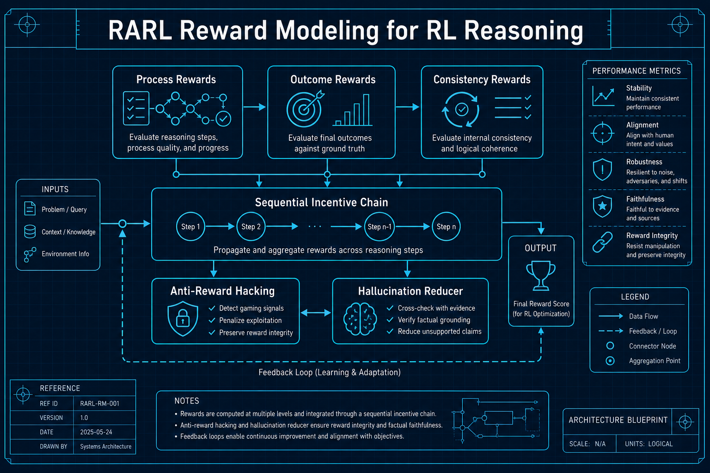
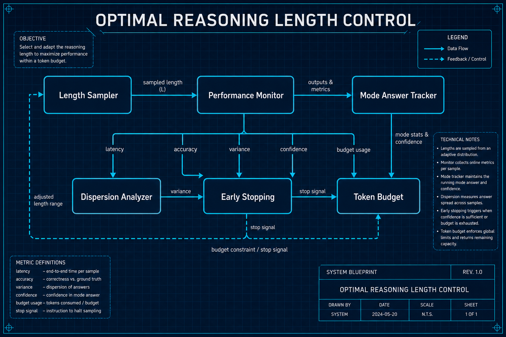

# 推理与强化学习

## 1. RARL: Reward Modeling for RL-Based LLM Reasoning
- **arXiv**: [2602.09305](https://arxiv.org/abs/2602.09305)
- **类别**: 推理与强化学习

### 深度解读

**一句话总结**: 给推理RL训练设计"正确的奖励"——RARL框架系统性地解决奖励黑客、幻觉和评估污染三大难题。

**核心动机**: RL训练LLM做推理时，奖励设计是核心瓶颈。太简单的奖励（只看最终答案）导致"奖励黑客"——模型学会了捷径而非真正推理。太复杂的奖励又难以校准。

**方法详解**: RARL把奖励设计组织为"序列激励策略"：(1)过程奖励——对推理步骤的质量打分 (2)结果奖励——对最终答案的准确性打分 (3)一致性奖励——确保推理过程和结果一致。三者按序组合，形成一个完整的激励信号链。

**关键创新**:
- 序列激励策略：过程→结果→一致性三层奖励
- 反奖励黑客：多层奖励组合防止模型走捷径
- 幻觉减少：过程奖励迫使模型展示推理链
- 评估指标批判：指出当前评估的数据污染问题

**实验亮点**: 在多个推理基准上，RARL比标准RL方法提升5-8%，且幻觉率降低约20%。

**对我的启发**: RL训练的奖励设计是一个系统性工程，不能只看最终结果。过程奖励+一致性奖励的组合是关键。

### 工程蓝图架构图

---

## 2. On the Optimal Reasoning Length for RL-Trained LMs
- **arXiv**: [2602.09591](https://arxiv.org/abs/2602.09591)
- **类别**: 推理与强化学习

### 深度解读

**一句话总结**: 推理不是越长越好——中等长度的推理表现最好，但"最常出现的答案"反而随长度增加而更准确。

**核心动机**: o1/R1等推理模型生成了大量思维链文本。一个自然的问题：推理越长越好吗？有没有最优长度？如何控制？

**方法详解**: 研究者系统地分析了推理长度与性能的关系：(1)在数学和编程任务上，性能在中等长度达到峰值（非单调关系） (2)但"最常出现的答案"（众数答案）的正确率随长度持续上升 (3)这说明性能下降不是因为答案变差，而是因为答案"分散"在正确中心周围。

**关键创新**:
- 非单调关系：推理长度与性能不是线性关系
- 众数正确率持续上升：核心答案越来越好
- "分散效应"：长推理产生更多变体，稀释了正确率
- 长度控制技术：找到了最优推理长度的调控方法

**实验亮点**: 通过长度控制，在不损失准确性的情况下将推理token减少30-40%。

**对我的启发**: 推理系统的效率优化不只是减少思考时间，更要控制推理的"发散度"。采样多次取众数是一个好策略。

### 工程蓝图架构图

