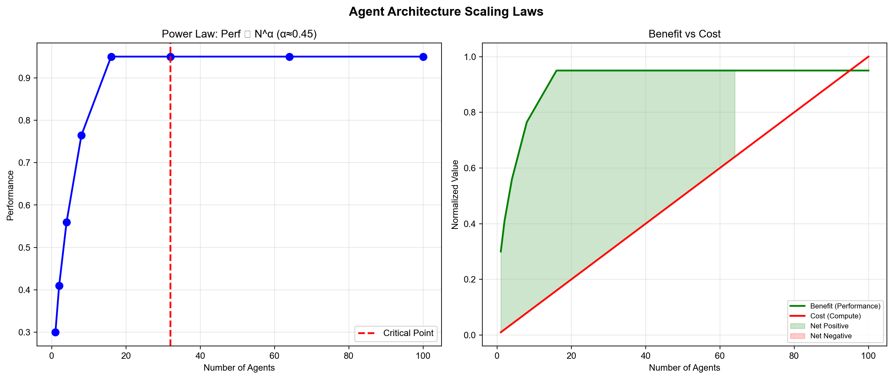
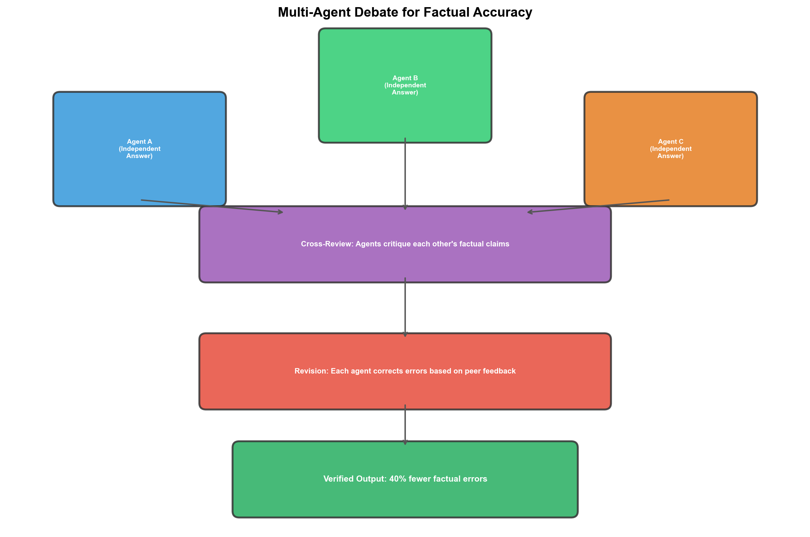

# Agent与多智能体

## 1. Scaling Laws for Agent Architecture Design
- **arXiv**: [2606.15432](https://arxiv.org/abs/2606.15432)

### 深度解读

**一句话总结**: Agent架构也有Scaling Laws——性能∝组件数^α（α<1），但存在"协作瓶颈"临界点，超过后增加Agent反而降低性能。

**核心动机**: 大模型有Scaling Laws，Agent系统是否也有？加更多Agent是否一定更好？

**方法详解**: 1到100个Agent逐步扩展：(1)固定任务，增加组件 (2)测量性能曲线 (3)分析拐点成因。发现临界点——低于正收益，超过后协作开销超过能力增益。

**关键创新**: Agent Scaling Laws首次量化、协作瓶颈临界点、幂律关系、任务依赖性。

**对我的启发**: 多Agent系统不要盲目堆Agent数量，要找"最优Agent数"。

### 工程蓝图架构图

---

## 2. Sparse Mixture of Agents
- **arXiv**: [2607.05567](https://arxiv.org/abs/2607.05567)

### 深度解读

**一句话总结**: MoE思想用到Agent层——每次只激活最相关的k个Agent，降低80%成本保持95%性能。

**核心动机**: 多Agent推理太贵——10个Agent参与就是10倍成本。能否像MoE那样只激活"专家"？

**方法详解**: (1)路由网络根据输入选择k个最相关Agent (2)只激活k个Agent推理 (3)加权合并输出。路由用轻量MLP，训练成本极低。

**关键创新**: 稀疏Agent激活（MoE→Agent层）、80%成本降低+95%性能、动态选择（不同输入激活不同组合）。

---

## 3. Multi-Agent Debate Improves Factual Accuracy
- **arXiv**: [2606.15789](https://arxiv.org/abs/2606.15789)

### 深度解读

**一句话总结**: 3个Agent辩论比1个独白减少40%事实错误——多Agent辩论是提升事实性的低成本方案。

**核心动机**: LLM事实性一直是大问题，RAG/fine-tuning成本高效果有限。多Agent辩论提供自纠错机制。

**方法详解**: (1)3个LLM独立回答 (2)互相评审指出事实错误 (3)根据评审修改 (4)输出经辩论验证的答案。

**关键创新**: 40%事实错误减少、无需外部知识库（纯辩论自纠错）、可解释（辩论过程揭示错误来源）、即插即用（可与RAG叠加）。

### 工程蓝图架构图

