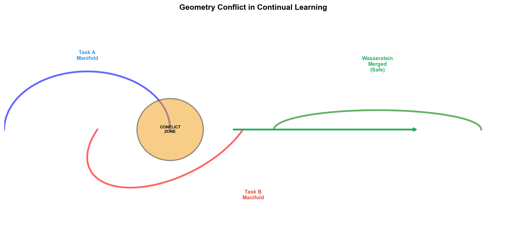
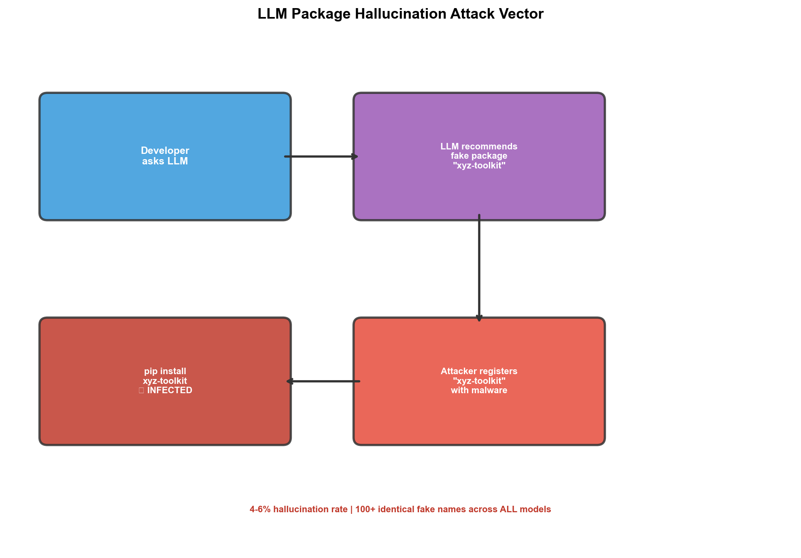

# LLM理论与安全

## 1. Geometry Conflict: Forgetting in LLM Continual Post-Training
- **arXiv**: [2605.09608](https://arxiv.org/abs/2605.09608)

### 深度解读

**一句话总结**: LLM连续微调的灾难性遗忘源于梯度方向与参数流形的几何冲突——提出Wasserstein合并，无需原始数据即可安全合并更新。

**核心动机**: 连续微调时后训任务"覆盖"先训能力。传统方法（EWC、PackNet）效果有限因为没找到根本原因。

**方法详解**: Wasserstein度量分析参数空间几何：(1)每个任务形成参数"流形" (2)流形几何冲突时新梯度破坏旧能力 (3)Wasserstein合并——找两个流形的最优传输路径沿此合并。

**关键创新**: 几何冲突理论（首次从几何角度解释遗忘）、Wasserstein合并（无需原始数据）、跨模型验证、不增加训练成本。

**对我的启发**: 多任务微调时分析梯度方向是否冲突，用Wasserstein合并代替顺序微调。

### 工程蓝图架构图

---

## 2. LLMs Reorganize Representational Geometry During ICL
- **arXiv**: [2605.28854](https://arxiv.org/abs/2605.28854)

### 深度解读

**一句话总结**: ICL的秘密——LLM通过重组内部表示空间使任务相关类别更线性可分，类似"原型匹配"。

**核心动机**: ICL是LLM最神奇的能力——给几个例子就能学会新任务且无需更新权重。到底怎么工作的？

**方法详解**: 探针追踪表示空间变化：(1)无示例时类别混合 (2)给定示例后表示空间被重组——相关类别拉开距离 (3)类似"原型匹配"——新样本被拉向同类原型。

**关键创新**: 表示几何重组（ICL机械级解释）、原型匹配机制、线性可分性增强、无需权重更新。

---

## 3. Re-evaluating LLM Package Hallucinations
- **arXiv**: [2605.17062](https://arxiv.org/abs/2605.17062)

### 深度解读

**一句话总结**: 所有前沿LLM仍有4-6%概率推荐不存在的包，100+假包名在所有模型中完全一致——恶意者可"抢注"植入恶意代码。

**核心动机**: AI编程助手推荐的依赖包若不存在，开发者可能从不可信源安装，引入供应链安全风险。

**方法详解**: 系统测试GPT-5/Claude/Gemini推荐包行为：(1)各种编程任务让LLM推荐包 (2)检查是否真实存在 (3)分析幻觉模式。

**关键创新**: 跨模型一致的幻觉模式（100+假包名完全一致）、安全风险（数十个可被恶意注册）、根因（训练数据系统偏差）、缓解建议（集成包名验证）。

**对我的启发**: AI编程助手推荐包时一定要验证是否存在。这个安全漏洞可被利用进行供应链攻击。

### 工程蓝图架构图

