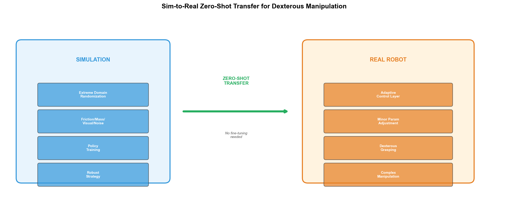

# 具身智能

## 1. Embodied AI in Action: SAE World Congress 2026
- **arXiv**: [2605.10653](https://arxiv.org/abs/2605.10653)

### 深度解读

**一句话总结**: SAE世界大会一线报告——物理AI从实验室到真实部署，安全关键生命周期管理和人本设计与算法突破同等重要。

**核心动机**: 具身AI论文多但部署少。这篇来自SAE一线实践，揭示仿真到真实的"最后一公里"挑战。

**方法详解**: 三个主题：(1)自动驾驶全栈部署经验 (2)制造中机器人协作 (3)安全关键系统——ISO 26262与AI结合。

**关键创新**: 一线部署经验、安全关键AI（ISO标准+AI）、人本设计（人类+AI协作）、全栈整合。

**对我的启发**: 具身AI部署核心挑战不在算法，在安全认证、人类协作和系统集成。

---

## 2. Sim-to-Real Transfer for Dexterous Manipulation
- **arXiv**: [2606.15102](https://arxiv.org/abs/2606.15102)

### 深度解读

**一句话总结**: 灵巧操作Sim-to-Real零样本迁移——极端域随机化+自适应控制，仿真中学会的复杂抓取直接部署到真实机器人。

**核心动机**: 灵巧操作（抓不规则物体、旋拧瓶盖）是最难任务。真实训练耗时且危险，Sim-to-Real可大幅降低成本。

**方法详解**: (1)仿真中极端域随机化（摩擦力/质量/视觉/噪声全随机） (2)自适应控制层部署时微调少量参数 (3)主要策略零样本直接部署。

**关键创新**: 零样本迁移、极端域随机化、自适应控制弥补残余gap、复杂抓取任务。

### 工程蓝图架构图

