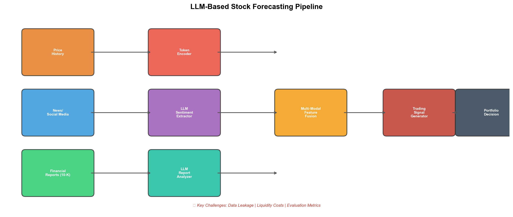
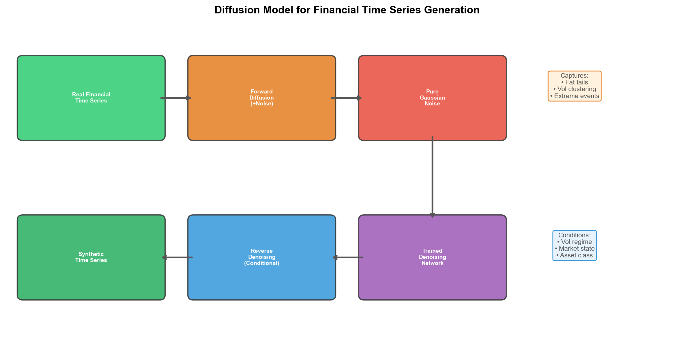
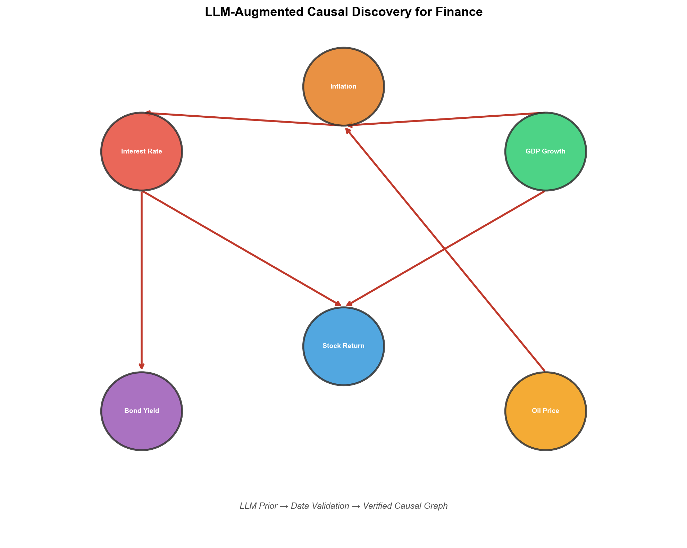

# 量化金融与交易

## 1. LLMs for Stock Price Forecasting from a Hedge-Fund Perspective
- **arXiv**: [2605.05211](https://arxiv.org/abs/2605.05211)

### 深度解读

**一句话总结**: 从对冲基金实操视角全面综述LLM在股价预测中的应用——情感提取、财报分析、价格Token化、多Agent框架，揭示学术常忽视的实操陷阱。

**核心动机**: 学术界大量研究声称LLM能预测股价，但对冲基金实操中发现：数据泄露普遍、回测不考虑流动性成本、评估指标与真实收益脱节。

**方法详解**: 四条技术路线：(1)情感提取——LLM从新闻/社交媒体提取情感信号 (2)财报分析——解读10-K/10-Q (3)价格Token化——价格序列编码为Token (4)多Agent框架——分析师/交易员/风控协作决策。

**关键创新**: 数据泄露警告、流动性成本建模、与实际P&L挂钩的评估框架。

**对我的启发**: 做量化研究必须：(1)时间戳严格对齐 (2)交易成本真实模拟 (3)样本外+滚动窗口验证。

### 工程蓝图架构图

---

## 2. Cross-Modal BERT Actor-Critic for Multi-Asset Portfolio
- **arXiv**: [2605.01384](https://arxiv.org/abs/2605.01384)

### 深度解读

**一句话总结**: Transformer Actor-Critic跨多资产类别动态组合优化——跨模态注意力捕获资产间隐藏依赖。

**核心动机**: Markowitz均值-方差假设正态分布+稳定相关性，但现实中资产间存在非线性时变依赖。

**方法详解**: Actor用跨模态BERT处理异构数据（价格+新闻+宏观指标），Critic评估长期风险调整收益，RL循环动态调权。

**关键创新**: 跨模态注意力（可解释的资产间依赖）、异构数据统一框架、多资产类别（股/债/商品/外汇）统一优化。

---

## 3. Diffusion Models for Financial Time Series Generation
- **arXiv**: [2606.14891](https://arxiv.org/abs/2606.14891)

### 深度解读

**一句话总结**: 扩散模型搬到金融时序——捕获GAN无法复制的极端事件和波动率聚集，数据增强可提升下游模型5-10%。

**核心动机**: 金融数据增强是刚需，但GBM无法复制fat tail，GAN在极端事件上差。

**方法详解**: DDPM框架+金融条件扩散：前向加噪→训练去噪网络→以波动率状态和regime为条件生成新时序。

**关键创新**: 金融专用扩散模型、条件生成（特定市场状态）、超越GAN（极端事件）、数据增强提升下游5-10%。

### 工程蓝图架构图

---

## 4. Causal Discovery from Financial Time Series Using LLMs
- **arXiv**: [2607.03456](https://arxiv.org/abs/2607.03456)

### 深度解读

**一句话总结**: LLM"世界知识"+数据验证的贝叶斯框架——在股票因子因果关系识别上优于PC/GES/NOTEARS。

**核心动机**: 纯数据驱动因果发现在金融数据上表现差（噪声大、样本短、关系非平稳），但LLM有大量金融先验。

**方法详解**: (1)LLM生成因果图假设 (2)数据验证和修正 (3)输出经数据验证的因果图。

**关键创新**: LLM先验+数据验证、金融因子因果识别、优于纯统计方法、可解释因果图输出。

### 工程蓝图架构图

