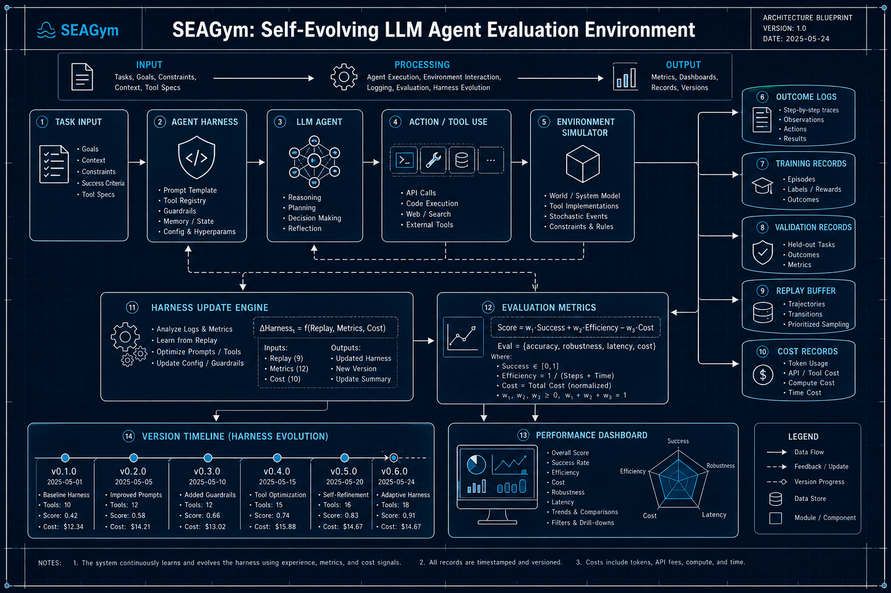
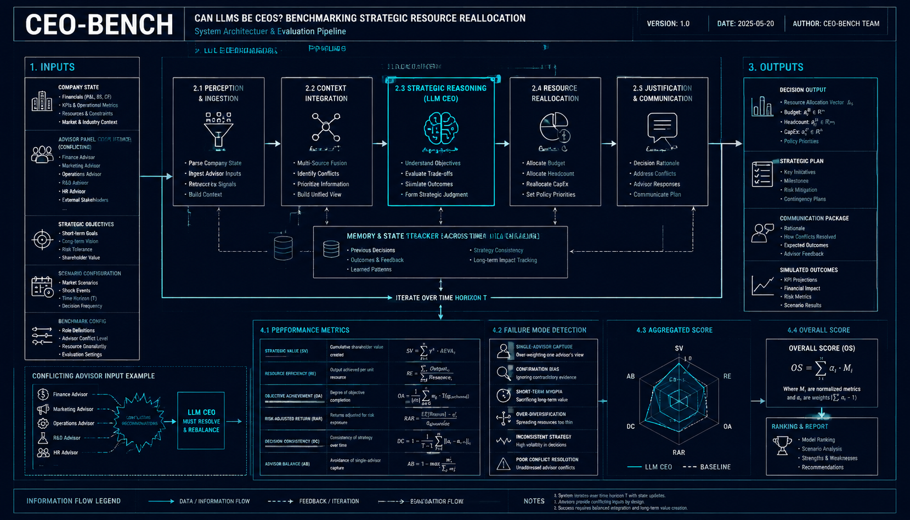
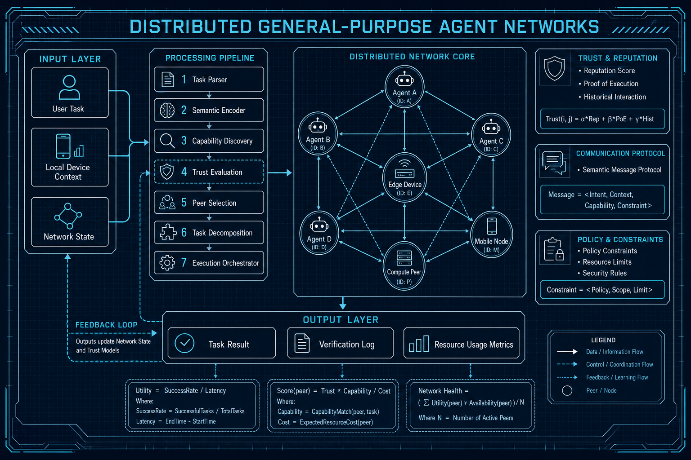

# Agent与多智能体 — arXiv论文复现 (2026-06-16 & 06-17)

> GPT-5.5 深度解读 + GPT-Image-2 工程蓝图配图

---

## SEAGym: Self-Evolving LLM Agent Evaluation

**Authors**: Congjie Zheng et al.  

**Abstract**: SEAGym measures agent self-evolution across training, validation, replay, and cost records.

### GPT-5.5 深度解读

**核心问题**:  
现有Agent评测多聚焦单次任务表现，难以衡量其在持续交互、复盘和资源约束下是否真正“自我进化”。SEAGym试图建立一个标准化环境，评估LLM Agent从经验中改进策略、提升泛化能力并控制成本的全过程。

**方法概述**:  
SEAGym将Agent评测拆分为训练、验证、回放和成本记录四条链路，而不是只看最终成功率。训练阶段观察Agent如何利用历史经验更新行为；验证阶段检验改进是否能迁移到新任务；回放机制用于分析失败案例、策略变化和记忆使用效果；成本记录则把token、调用次数、时间等纳入评估，避免“高成本堆性能”。这种设计使Agent能力评估从静态benchmark转向动态生命周期评估。

**架构解析**:
- 要点1：以“自我进化”为核心指标，关注Agent在多轮任务后的性能变化曲线，而非单点成绩。
- 要点2：引入训练/验证分离，能区分真实能力提升与对特定任务或轨迹的过拟合。
- 要点3：记录回放与成本信息，使评测具备可解释性和工程可用性，便于定位进化是否来自更好规划、记忆或工具调用。

**实验亮点**:  
- 展示不同Agent在持续训练过程中的成长速度、稳定性和退化风险。  
- 通过回放记录揭示成功率提升背后的行为模式变化。  
- 将性能收益与资源消耗绑定，评估“性价比进化”。

**对从业者的启示**:  
- 构建Agent系统时应记录完整轨迹、失败样本和成本，而不只是最终答案。  
- 需要区分短期提示优化与长期自我改进，避免把记忆堆叠误认为学习。  
- 部署前应验证Agent在新任务上的迁移能力和成本可控性。

**局限性**:  
- 自我进化的定义仍可能依赖任务设计和指标权重。  
- 若环境复杂度不足，评测结果未必能完全代表真实开放场景中的Agent成长能力。

---

## Can LLMs Be CEOs? CEO-Bench

**Authors**: Yuyang Dai et al.  

**Abstract**: CEO-Bench evaluates strategic resource allocation with conflicting advisor inputs. Finds single-advisor capture.

### GPT-5.5 深度解读

**核心问题**: CEO-Bench关注LLM是否具备CEO级战略资源配置能力：在信息不完整、目标冲突、多方建议相互矛盾的情境下，模型能否做出稳健决策。论文的核心发现是，LLM容易出现“单一顾问俘获”，即过度依赖某个顾问意见而丧失全局判断。

**方法概述**: 该基准构造了类似企业高层决策的任务场景，要求模型在有限资源下进行战略分配。场景中包含多个顾问角色，他们提供带有偏见、局部目标或相互冲突的建议。模型需要综合财务、市场、运营等因素，而不是简单采纳某一方意见。评估重点不是语言流畅性，而是决策质量、权衡能力与抗干扰能力。

**架构解析**:
- 任务设计强调“资源稀缺+目标冲突”，更接近真实CEO决策，而非单步问答。
- 多顾问输入模拟管理层会议，测试模型能否识别建议背后的立场、利益和信息局限。
- 评价维度聚焦战略一致性、收益风险权衡、信息整合能力，以及是否被单一观点主导。

**实验亮点**:  
1. 揭示了LLM在高层决策中的新型失败模式：并非不知道信息，而是被某个看似合理的建议“带偏”。  
2. 将LLM评测从知识与推理扩展到组织决策场景，具有更强管理实践意义。  
3. 结果提示，更强模型也未必天然具备更好的治理与权衡能力。

**对从业者的启示**:  
1. 在企业决策中使用LLM时，应避免让模型只接触单一部门或单一顾问视角。  
2. 需要设计反方意见、审计机制和多轮质询流程，降低顾问俘获风险。  
3. LLM更适合作为决策辅助工具，而非直接替代高层决策者。

**局限性**:  
1. 基准任务仍是模拟环境，难以完全覆盖真实企业中的长期反馈、政治因素和不确定性。  
2. 对“好决策”的评价可能依赖预设标准，未必适用于所有行业和战略阶段。

---

## Distributed General-Purpose Agent Networks

**Authors**: Shengli Zhang et al.  

**Abstract**: P2P agent network with semantic communication and trust mechanisms for open task execution.

### GPT-5.5 深度解读

**核心问题**: 论文关注如何让分散在不同设备、组织和网络环境中的智能体，在没有中心化调度器的情况下完成开放式任务协作。核心挑战在于语义对齐、能力发现、可信交互与任务执行的可验证性。

**方法概述**: 该工作提出一种P2P通用Agent网络架构，将Agent视为可发现、可通信、可组合的自治节点。节点之间不只交换文本或API调用，而是通过语义通信表达任务意图、能力边界、上下文约束与执行结果。系统引入信任机制，对Agent身份、历史表现、任务完成质量和交互风险进行评估。整体目标是形成一个开放任务市场式的协作网络，使不同Agent能够动态组队、分解任务并完成跨设备执行。

**架构解析**:
- 要点1：网络层采用P2P连接，弱化中心平台依赖，提高系统的开放性、抗单点故障能力和跨域部署能力。
- 要点2：语义通信层是关键，它将“我要做什么”“我能做什么”“结果是否满足要求”结构化表达，降低异构Agent之间的协作成本。
- 要点3：信任层为开放网络提供安全边界，通过信誉、验证、权限和风险控制机制，避免恶意Agent、低质量执行和数据滥用。

**实验亮点**:
- 展示了多个异构Agent在开放任务中的自动发现、协商与协作能力。
- 验证语义通信相比简单消息传递更有利于任务分解和结果对齐。
- 信任机制可提升协作成功率，并降低不可靠节点带来的系统风险。

**对从业者的启示**:
- 未来Agent系统不应只围绕单个超级助手构建，而应考虑多Agent网络化协作。
- 企业落地时需要优先设计能力描述、权限控制、审计和信誉评估机制。
- 语义协议可能比具体模型更重要，是跨模型、跨平台Agent互操作的基础。

**局限性**:
- 开放P2P网络中的安全、隐私和责任归属仍然复杂，难以完全依赖信誉机制解决。
- 大规模Agent协作可能带来通信开销、语义误解和任务协调成本上升。

