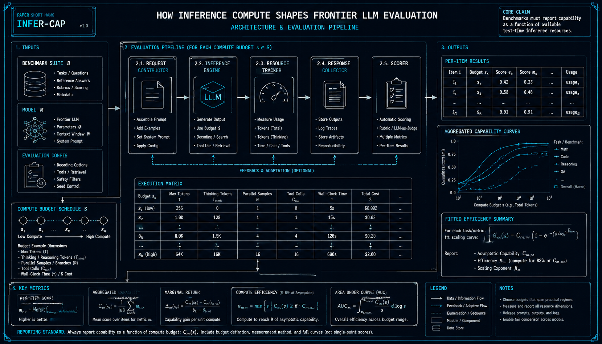
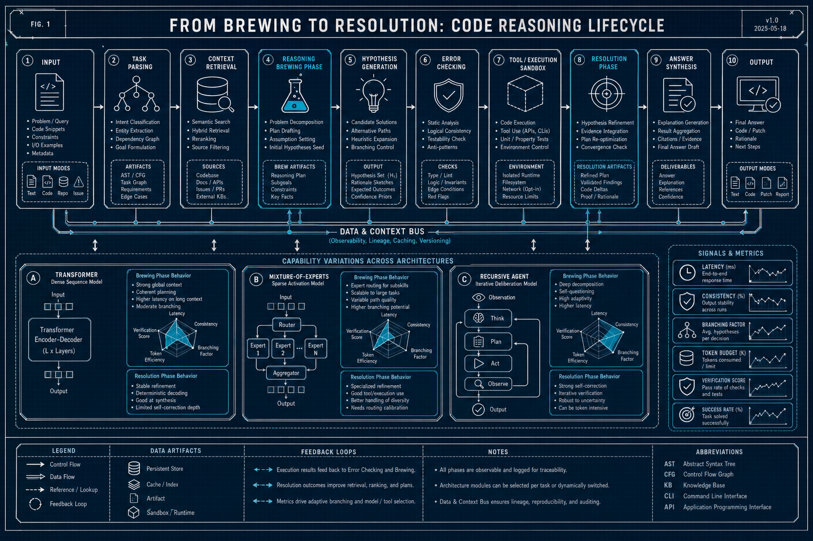

# LLM理论与分析 — arXiv论文复现 (2026-06-16 & 06-17)

> GPT-5.5 深度解读 + GPT-Image-2 工程蓝图配图

---

## How Inference Compute Shapes LLM Evaluation

**Authors**: Jessica McFadyen et al.  

**Abstract**: Benchmarks must report capability as function of test-time compute resources.

### GPT-5.5 深度解读

**核心问题**: 论文指出，传统LLM评测通常只报告“单次推理/固定预算”下的分数，无法反映模型在更多测试时计算资源下的真实能力。核心主张是：模型能力应被描述为随推理计算量变化的函数，而不是一个静态数值。

**方法概述**: 作者重新审视了LLM评测中的测试时计算，包括采样次数、思维链长度、自一致性投票、搜索、工具调用和验证器等。论文强调，同一模型在不同推理预算下可能呈现完全不同的性能排序。它建议基准测试应报告性能—计算曲线，而不仅是单点准确率。这样可以区分“参数能力”“推理策略效率”和“计算预算敏感性”。

**架构解析**:
- 要点1：评测对象不应只是模型权重，还应包括推理算法与测试时计算配置，例如采样温度、候选答案数、验证机制等。
- 要点2：性能可被建模为计算资源的函数，横轴是推理token数、样本数或总FLOPs，纵轴是准确率、成功率或效用。
- 要点3：不同模型可能在低预算和高预算区域表现不同，因此需要比较整条曲线，而非单一排行榜分数。

**实验亮点**:
- 展示增加测试时采样或推理步数可显著提升部分任务表现，尤其是数学、代码和复杂推理任务。
- 说明固定预算评测可能低估擅长“慢思考”的模型，也可能高估低成本但扩展性差的模型。
- 强调计算效率指标，如达到某一准确率所需的推理成本，比最高分更具实践意义。

**对从业者的启示**:
- 部署模型时应根据业务成本约束选择最优推理预算，而不是盲目追求榜单最高分。
- 评测报告应同时披露token消耗、采样次数、延迟和成本，便于公平复现。
- 在高价值任务中，增加测试时计算可能比更换更大模型更划算。

**局限性**:
- 不同任务的计算预算难以统一度量，token数、时间和FLOPs并不完全等价。
- 若缺少标准化协议，性能—计算曲线本身也可能被调参策略影响。

---

## From Brewing to Resolution: Code Reasoning Lifecycle

**Authors**: Siyue Chen et al.  

**Abstract**: Studies answer brewing and resolution phases. Reveals capability variations across architectures.

### GPT-5.5 深度解读

(生成失败: 'choices')

