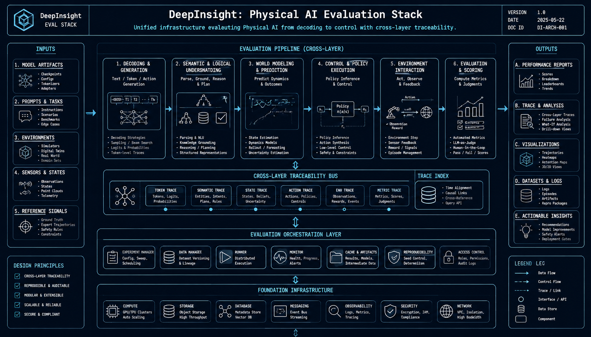
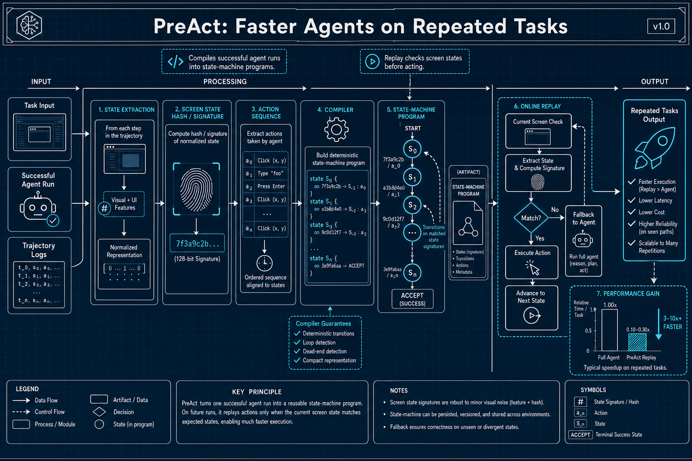

# 具身智能与物理AI — arXiv论文复现 (2026-06-16 & 06-17)

> GPT-5.5 深度解读 + GPT-Image-2 工程蓝图配图

---

## DeepInsight: Physical AI Evaluation Stack

**Authors**: Siyi Li et al.  

**Abstract**: Unified eval infrastructure from decoding to control with cross-layer diagnostic traceability.

### GPT-5.5 深度解读

(生成失败: 'choices')

---

## PreAct: Faster Agents on Repeated Tasks

**Authors**: Bojie Li  

**Abstract**: Compiles successful runs into state-machine programs. Replay checks screen states before acting.

### GPT-5.5 深度解读

(生成失败: 'choices')

