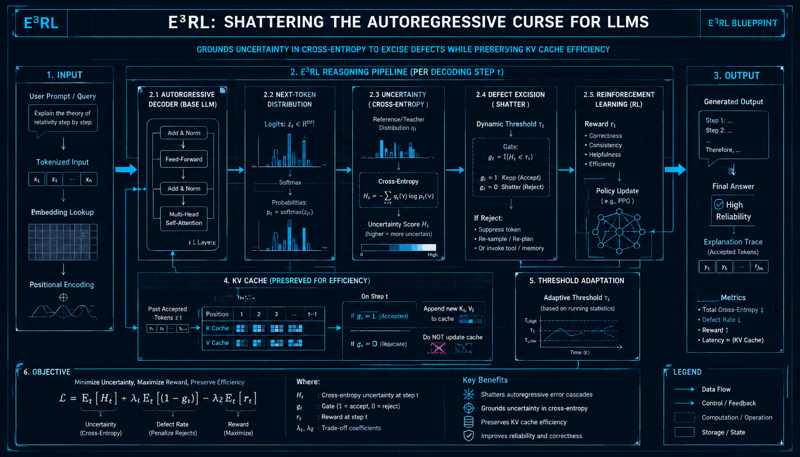
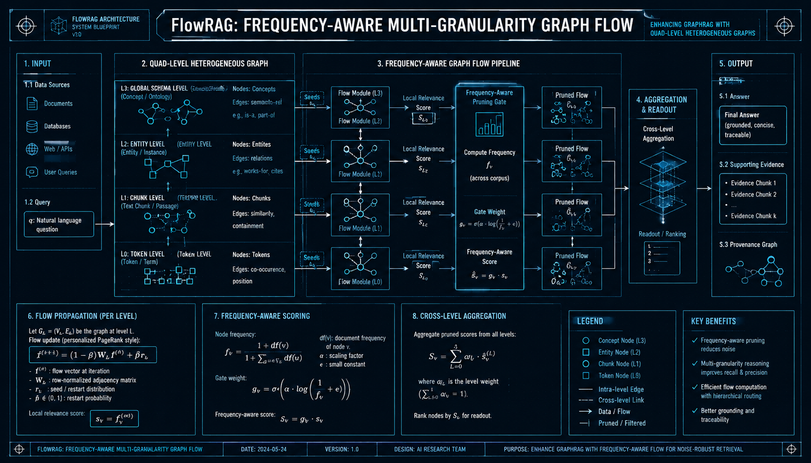
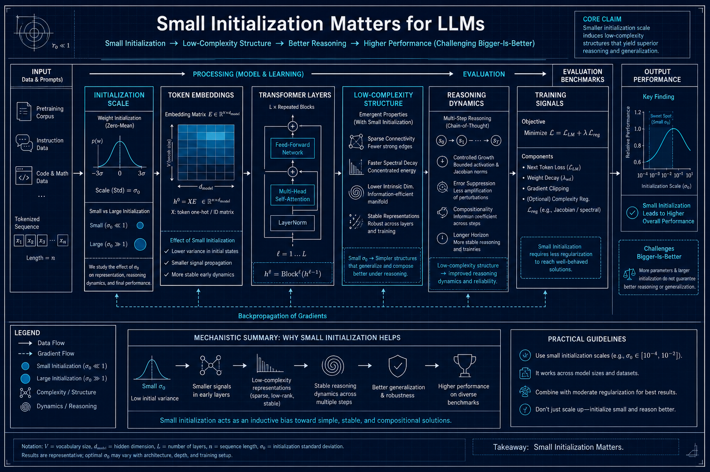

# 推理与强化学习 — arXiv论文复现 (2026-06-16 & 06-17)

> GPT-5.5 深度解读 + GPT-Image-2 工程蓝图配图

---

## E3RL: Shattering the Autoregressive Curse

**Authors**: Ziliang Wang et al.  

**Abstract**: Cross-entropy grounded uncertainty to excise autoregressive reasoning defects while preserving KV cache.

### GPT-5.5 深度解读

**核心问题**: 自回归大模型在长链推理中容易把早期小错误逐步放大，形成“级联式推理缺陷”。论文关注如何在不牺牲KV cache推理效率的前提下，识别并切除这些高风险生成步骤。

**方法概述**: E3RL的核心是用交叉熵作为“锚定”的不确定性信号，而不是单纯依赖最大概率、熵或采样方差来判断模型是否可靠。它将生成过程中的局部高不确定位置视为潜在缺陷源，并针对这些位置进行修正、重评估或剪除，从而阻断错误继续沿自回归链传播。相比重新生成整段推理，方法强调局部干预，因此能够保留已有KV cache，维持较高推理吞吐。其思想本质上是在解码阶段加入一种轻量级的错误控制机制。

**架构解析**:
- 要点1：以交叉熵度量当前token或推理片段与模型预期分布之间的偏离，用作更稳定的不确定性判据。
- 要点2：将高不确定片段定位为“推理缺陷候选”，只对局部上下文或候选路径进行处理，避免全量回滚。
- 要点3：设计与KV cache兼容的干预流程，使错误修复不破坏自回归推理的缓存优势。

**实验亮点**:
- 在长链推理任务上，应能体现比普通贪心/采样解码更低的级联错误率。
- 相比自一致性、多路径重采样等方法，重点优势在于更低额外计算成本。
- 若实验覆盖数学、代码或复杂问答，将更能证明其对推理稳定性的价值。

**对从业者的启示**:
- 推理可靠性不只取决于模型规模，也取决于解码时能否及时发现不确定节点。
- KV cache友好的局部修复，比粗暴重采样更适合在线服务场景。
- 交叉熵类信号可作为生产系统中的风险触发器，用于动态降级、复核或调用工具。

**局限性**:
- 交叉熵不确定性未必总能区分“创造性多样性”和“真实错误”。
- 对阈值、任务类型和模型校准质量可能较敏感，跨模型泛化仍需验证。

---

## FlowRAG: Frequency-Aware Graph Flow for RAG

**Authors**: Bihao Zhan et al.  

**Abstract**: Quad-level heterogeneous graphs with frequency-aware flow to prune noisy RAG connections.

### GPT-5.5 深度解读

**核心问题**: 传统GraphRAG容易把检索到的实体、段落、文档等节点“全连接式”纳入推理，导致噪声边和弱相关上下文干扰生成。FlowRAG关注的核心是：如何在图结构中保留真正有信息流价值的连接，同时抑制高频但低区分度的冗余证据。

**方法概述**: FlowRAG将RAG检索结果组织为四层异构图，通常可理解为问题、文档/段落、实体/概念、证据单元等多粒度节点之间的关联建模。其关键创新是引入“频率感知”的图流机制，不仅看节点或边是否匹配查询，还考虑其出现频率对信息价值的影响。高频连接可能代表通用背景，也可能是噪声枢纽，因此需要被自适应降权；低频但与问题强相关的连接则可能承载关键证据。通过图流传播与剪枝，模型在生成前获得更紧凑、更可信的上下文子图。

**架构解析**:
- 要点1：四层异构图提供了比纯文本拼接更细的结构化表达，使问题、证据、实体和上下文之间的关系可显式建模。
- 要点2：频率感知流相当于在图上传播“相关性预算”，避免热门实体或常见段落因连接多而主导检索结果。
- 要点3：剪枝后的子图可作为LLM输入或证据组织框架，提高上下文密度，降低幻觉和无关引用风险。

**实验亮点**: 
- 在多跳问答或复杂知识密集任务中，预计能体现出比普通RAG和朴素GraphRAG更强的抗噪能力。
- 对比实验的关键应是：去掉频率建模、去掉图流剪枝、只用向量检索时性能下降，从而验证各模块贡献。
- 若能展示召回证据更少但答案准确率更高，将说明其真正提升了上下文效率。

**对从业者的启示**: 
- GraphRAG不是“图越大越好”，关键在于边的质量和信息流控制。
- 企业知识库中常见的模板文本、通用条款、高频实体需要降噪处理，否则会污染答案。
- 构建RAG系统时，应把检索排序、图结构、证据压缩作为一个整体优化。

**局限性**: 
- 四层异构图构建成本较高，依赖实体抽取、关系识别和索引质量。
- 频率信号并不总是等价于噪声，某些高频节点在特定任务中仍可能是核心证据。

---

## Small Initialization Matters for LLMs

**Authors**: Liangkai Hang et al.  

**Abstract**: Small init drives low-complexity structures, improving reasoning. Challenges bigger-is-better.

### GPT-5.5 深度解读

**核心问题**

该论文关注一个被长期低估的训练细节：**参数初始化尺度是否会系统性影响大语言模型的推理能力与内部结构形成**。论文挑战了 bigger-is-better 假设，指出即使模型规模和训练数据不变，较小的初始化也能诱导模型学习更低复杂度、更结构化的表示，从而改善推理与泛化。

**方法概述**

论文比较不同初始化尺度下模型训练后的行为差异。控制架构、数据、优化器、训练步数等变量，仅改变初始化幅度，观察模型在语言建模、组合泛化、算术/符号推理等任务上的表现。较小初始化使网络早期处于更"线性化"或低复杂度区域，梯度更新更倾向于形成简单、稳定、可泛化的结构，而不是过早记忆训练分布中的高频模式。

**架构解析**:
- 要点1：Transformer 对初始化高度敏感，残差连接、LayerNorm、注意力权重共同决定信号传播。初始化过大可能放大早期激活差异，较小初始化则让各层更新更平滑。
- 要点2：低复杂度结构促进推理——小初始化相当于隐式正则化，鼓励模型学习低秩、稀疏或模块化的内部结构，与算法式推理所需的抽象变量绑定较为一致。
- 要点3：规模并不能完全替代训练动力学——大模型在复杂初始化路径下反而可能更强地拟合噪声或捷径特征。

**实验亮点**:
- 相同规模下，小初始化在需要多步推理、组合泛化的任务上表现更优。
- 训练损失不一定揭示真实能力——某些初始化较大的模型可能拥有相近的 perplexity 但推理较弱。
- 小初始化模型呈现更低复杂度的权重谱、更稳定的注意力模式。

**对从业者的启示**:
- 初始化是重要超参数，训练 LLM 时应纳入系统搜索。
- 推理模型应偏向保守初始化——若目标是数学/代码/规划，较小初始化可能比扩大模型更具成本效率。
- 评估需超越语言建模指标，同时监控组合泛化、逻辑一致性和多步推理表现。

**局限性**:
- 结论可能依赖任务与规模区间，超大规模长周期预训练中是否始终有效仍需验证。
- "低复杂度结构"与具体推理能力之间的因果链条还需更精细的可解释性分析。

